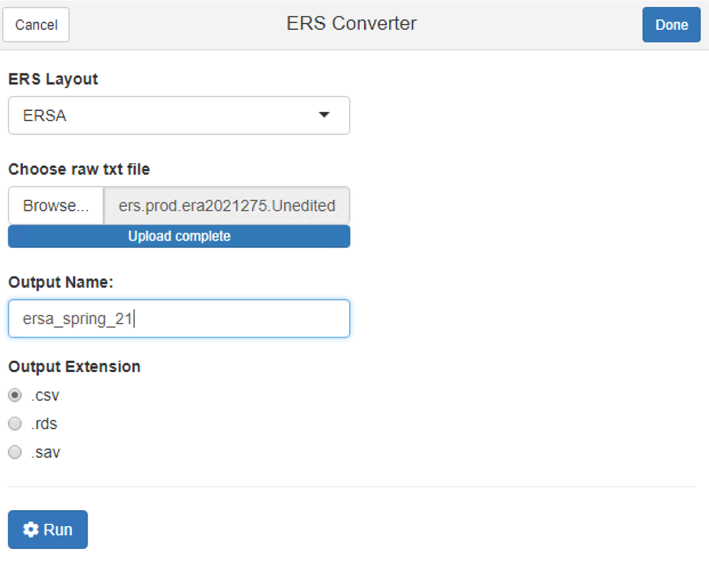

<!-- README.md is generated from README.Rmd. Please edit that file -->

```{r, include = FALSE}
knitr::opts_chunk$set(
  collapse = TRUE,
  comment = "#>",
  fig.path = "man/figures/README-",
  out.width = "100%"
)
```

# ERS

<!-- badges: start -->
<!-- badges: end -->

The goal of ERS is to provide easy access to ERS layouts as data frames.

## Installation

You can install ERS from GitHub with:

``` r
remotes::install_github("ir-sfsu/ERS")
```

## Example

This is a basic example which shows you how to solve a common problem:

```{r example}
library(ERS)
data("ersa")
head(ersa)

```

```{r eval = FALSE}
clean_raw_ers_txt_file("path_to_raw_txt_file.txt", type = "ERSA")
```


## Gadget

Invoke the gadget from the RStudio Addins dropdown or `ers_converter`.


